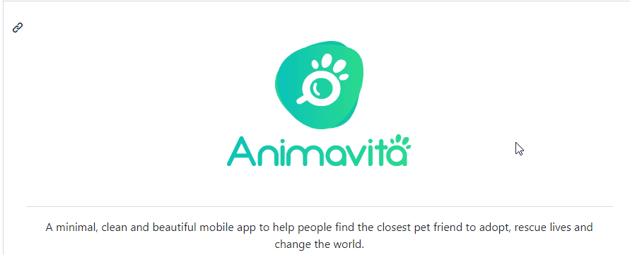

# Projeto com README

Apenas um projeto de teste com README 📚

[]

```
Para o gif levar a alguma pagina podemos colocar a pagina entre parênteses
[] (https://google.com)
```

## Tecnologias utilizadas

- HTML
- CSS
- JS

## Como utilizar

Clone pro projeto

```
git clone <url>
```

Acesse a pasta do projeto

```
cd repositorio-com-readme
```